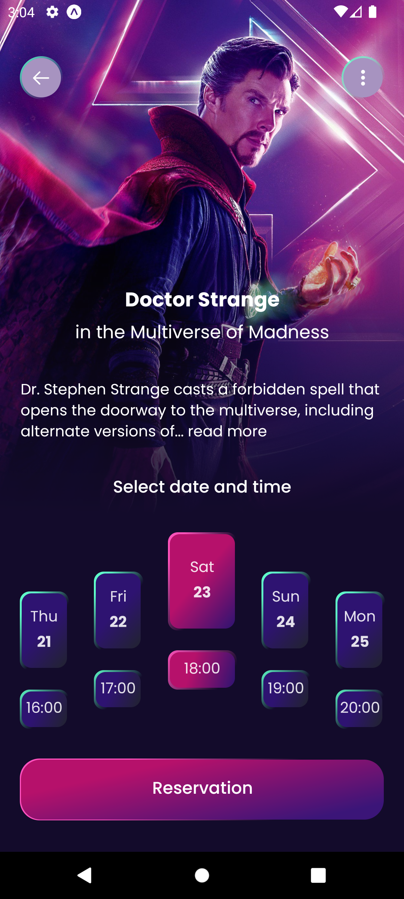

# Movie Ticket Booking
<br/>


<center>

</center>


# Sobre

Um simple app de compra de ingresso usado onde você pode escolhe o filme, um sessão e um asseto, foi desenvolvido utilizado react native.   


# Tecnologias

* [Expo](https://nextjs.org)
* [react-native](https://reactnative.dev)
* [react native reanimated](https://docs.swmansion.com/react-native-reanimated/)
* [typescript](https://www.typescriptlang.org/docs/handbook/intro.html)
* [expo-font](https://docs.expo.dev/versions/latest/sdk/font/)
* [expo-linear-gradient](https://docs.expo.dev/versions/latest/sdk/linear-gradient/)
* [expo-BlurView](https://docs.expo.dev/versions/latest/sdk/blur-view/)
* [react-native-svg](https://github.com/software-mansion/react-native-svg)
* [react-native-svg-transformer](https://github.com/kristerkari/react-native-svg-transformer)


# Design do Projeto

* UI foi feita por [Sourasith](https://www.figma.com/community/file/1102953368834419129/Movie-Ticket-Booking-App-Design)
* Visualizar [Ui](https://www.figma.com/community/file/1102953368834419129/Movie-Ticket-Booking-App-Design)


# Como Usar

### Clone this repository
```sh
git clone https://github.com/Josue-Js/movie-ticket-booking
```

### ir ao repositório

```sh 
cd movie-ticket-booking
```

### instalar dependencies

```sh 
yarn or npm install 
```

### executar projeto

```sh
yarn dev
```
